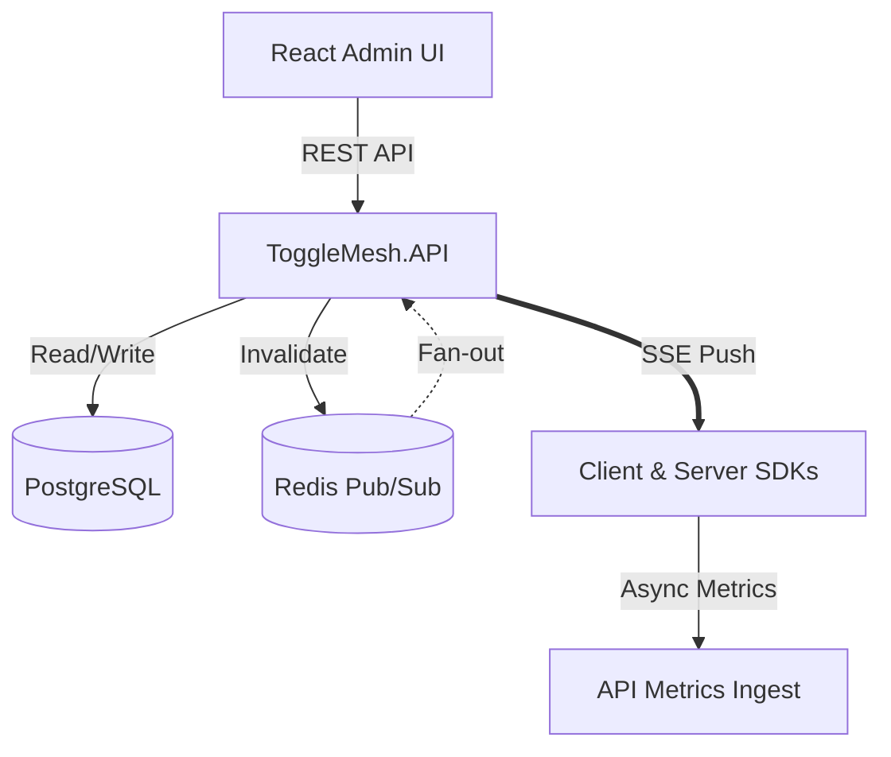

# ToggleMesh Architecture

ToggleMesh decouples state mutation from feature evaluation. Configurations are pushed to application servers over persistent **Server-Sent Events (SSE)** connections, allowing SDKs to evaluate rules locally in memory with zero network overhead.

## Architecture Diagram

## Core Components

- **Control Plane (`ToggleMesh.API`)**: FastEndpoints ASP.NET Core service managing projects, targeting rules, environments, and RBAC.
- **Admin UI (`ToggleMesh.AdminUI`)**: Modern React application for feature flag management, experiments, and audit logging.
- **Data Plane (SDKs)**: Local evaluation engine running in-process in your applications.
- **Real-Time Streaming**: Redis Pub/Sub combined with HTTP SSE to fan-out flag state updates to all connected instances within milliseconds.
